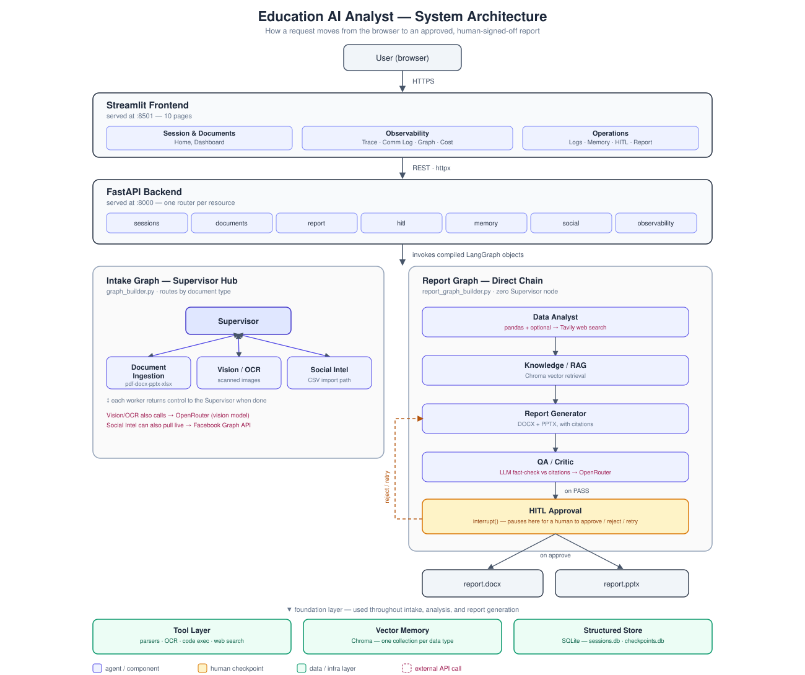

# Education AI Analyst

A multi-agent AI system — one Supervisor plus seven worker agents — that reads education
documents (PDF, DOCX, PPTX, XLSX, scanned images) and Facebook comments, analyzes them for
teacher-performance and enrollment signals, and produces a report that a human reviews and
approves before it's released.

Built for the *Computer Science Applications and Advancements* course (2nd Semester, MSc) by
**Tarin, Saif, Shohana, and Fahim**.

**Live demo:** [education-ai-analyst-apkc5i5n8vfya3n2njtvoe.streamlit.app](https://education-ai-analyst-apkc5i5n8vfya3n2njtvoe.streamlit.app/)
*(as of this writing the app is set to private on Streamlit Community Cloud and redirects to a
login page — set Settings → Sharing → public before relying on this link for grading)*

## Architecture



The intake pipeline routes through a **Supervisor hub** (every worker returns control to it);
the report pipeline is a **direct chain** with zero Supervisor involvement — two different
LangGraph collaboration patterns, chosen deliberately for the shape of each problem. See
[`docs/architecture.md`](docs/architecture.md) for the full write-up (ERD, API spec, tech
decisions, roadmap) and [`docs/innovation-highlights.md`](docs/innovation-highlights.md) for
what's worth pointing out in a demo.

## Stack

| Layer | Choice |
|---|---|
| Orchestration | LangGraph (`StateGraph`, `interrupt()` for human-in-the-loop) |
| Backend | FastAPI |
| Frontend | Streamlit (10 pages) |
| LLMs | OpenRouter — free-tier models with a fallback list |
| Embeddings | local `sentence-transformers` (OpenRouter doesn't serve embeddings) |
| Vector memory | Chroma — one collection per data type |
| Structured data | SQLite (`data/sessions.db`, `data/checkpoints.db`) |
| Optional live data | Facebook Graph API (Social Intelligence), Tavily (web-search context) |

## The 8 agents

1. **Supervisor** — plans work, routes documents, aggregates results
2. **Document Ingestion** — PDF/DOCX/PPTX/XLSX → structured text/tables
3. **Vision/OCR** — scanned forms, screenshots → text (vision LLM)
4. **Data Analyst** — pandas over enrollment/result data, optional web-search benchmark context
5. **Social Intelligence** — Facebook comments → sentiment (live Graph API or CSV import)
6. **Knowledge/RAG** — Chroma-backed semantic memory shared across the run
7. **Report Generator** — compiles a cited DOCX + PPTX report
8. **QA/Critic** — fact-checks the draft against source data before a human sees it

## Setup

**Prerequisites:** Python 3.11+, a free [OpenRouter](https://openrouter.ai) account.

```bash
git clone https://github.com/sumaiyaSultanaTarin/Education-AI-Analyst.git
cd Education-AI-Analyst

python -m venv .venv
# Windows:
.venv\Scripts\Activate.ps1
# macOS/Linux:
source .venv/bin/activate

pip install -r requirements.txt
```

Create your own `.env` from the template and add your key:

```bash
cp .env.example .env
```

Then edit `.env` and set:

```
OPENROUTER_API_KEY=sk-or-v1-...
```

Get a free key at [openrouter.ai/keys](https://openrouter.ai/keys) — **set it to "no
expiration"** when creating it. No payment method is needed for the free-tier (`:free`)
models this project uses. `FB_PAGE_ACCESS_TOKEN`/`FB_PAGE_ID` and `TAVILY_API_KEY` are
optional — leave them blank to use the CSV-import fallback and skip the web-search step.

**Never commit `.env`** — it's already in `.gitignore`.

## Running it

Two terminals, both from the repo root with the venv activated:

```bash
# Terminal 1 — backend (http://localhost:8000)
cd backend
uvicorn api.main:app --reload
```

```bash
# Terminal 2 — frontend (http://localhost:8501)
cd frontend
streamlit run Home.py
```

Open `http://localhost:8501`, create a session, upload a document (try the samples in
`data/sample_docs/`), run intake, generate a report, approve it on HITL Controls, and download
it from Final Report.

## Testing

```bash
cd backend
pytest
```

## Project structure

```
backend/
  agents/       one file per agent, only talks to the Supervisor
  graph/        LangGraph state + graph builders
  tools/        parsers, OCR, Facebook API, web search, RAG
  api/          FastAPI app + routes
  core/         config, logging, LLM client, cost tracker
  tests/
frontend/
  Home.py
  pages/        10 Streamlit pages
  utils/
docs/           architecture, ERD, demo script, this README's diagram source
data/
  sample_docs/  test fixtures (xlsx, pdf, docx, images, Facebook CSV)
```

## Documentation

- [`docs/architecture.md`](docs/architecture.md) — full architecture, ERD, API spec, roadmap
- [`docs/demo-script.md`](docs/demo-script.md) — step-by-step demo walkthrough
- [`docs/innovation-highlights.md`](docs/innovation-highlights.md) — what to point out and why
